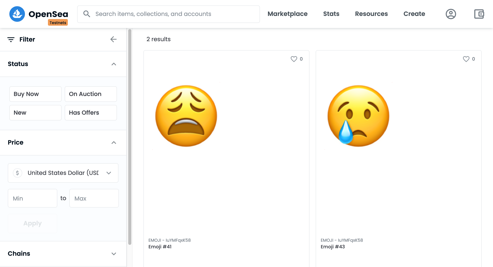
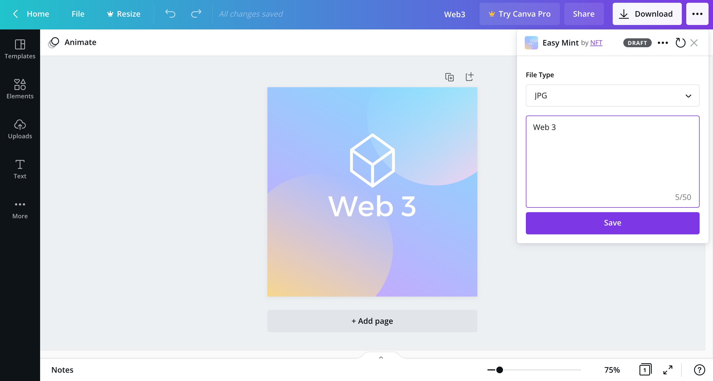
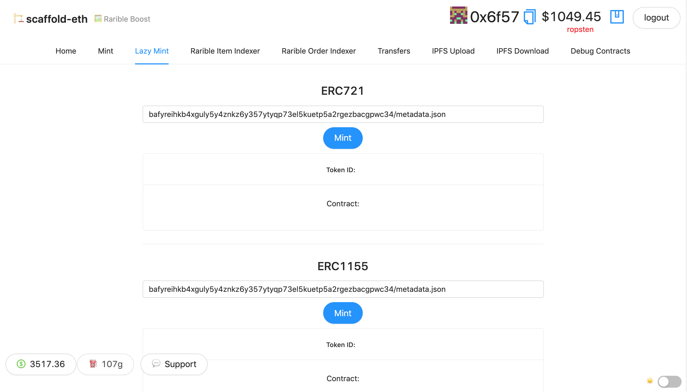
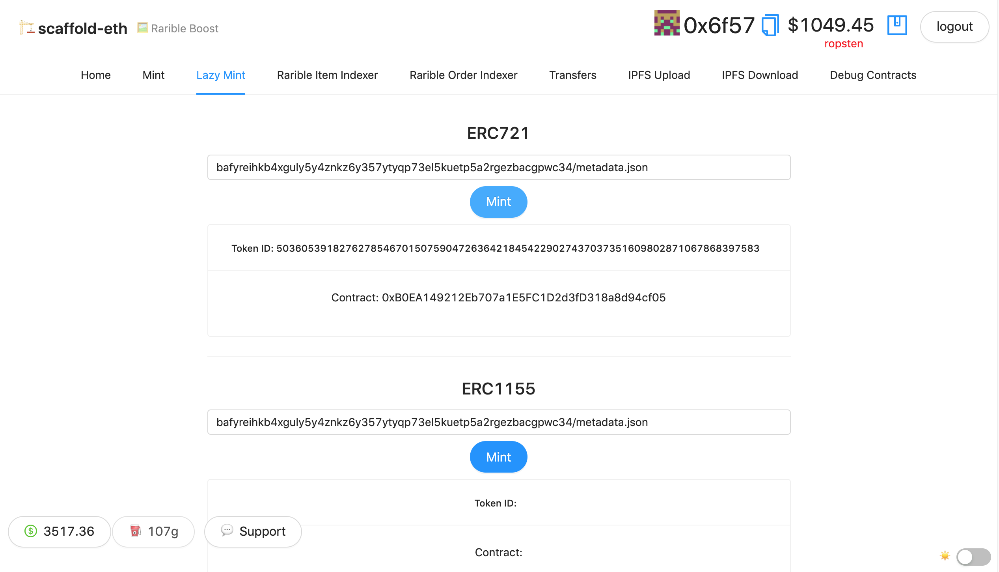
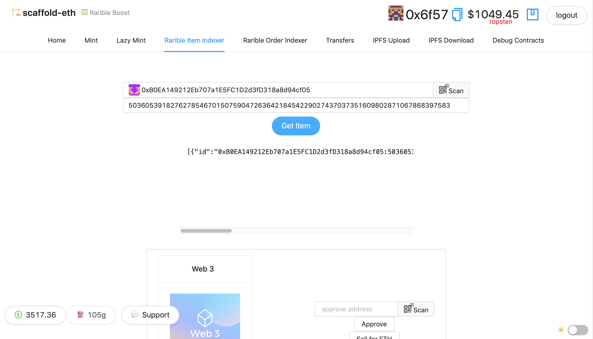

# NFT Tools

NFT Tools consists of various NFT related tools for experimentation and learning.

#[On-Chain Emoji NFT](on_chain_emoji_nft/README.md)

On-Chain Emoji NFT POC allows you to mint emoji based NFTs which are stored on-chain using SVG method. It uses Brownie which is Python-based development and testing framework for smart contracts targeting the Ethereum Virtual Machine. It also uses Chainlink VRF (Verifiable Random Function) which is a provably-fair and verifiable source of randomness designed for smart contracts.

#[Easy Mint](easy_mint/README.md)

Easy Mint allows you to lazy mint NFTs for free. Token metadata & minting signatures are stored on Rarible back-end until a buyer fills the order. It also includes integration for Canva NFT Minter which allows the Canva users to publish their designs as NFT using the custom Canva Publish app. Easy Mint is powered using scaffold-eth - Rarible Starter App and Canva NFT Minter.

