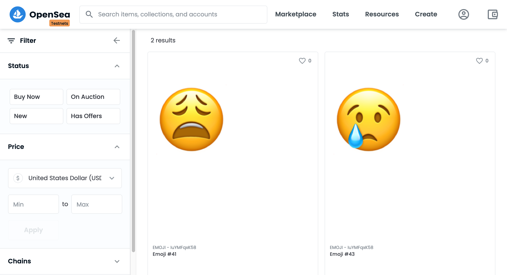

# On-Chain Emoji NFT

On-Chain Emoji NFT POC allows you to mint emoji based NFTs which are stored on-chain using SVG method. It uses Brownie which is Python-based development and testing framework for smart contracts targeting the Ethereum Virtual Machine. It also uses Chainlink VRF (Verifiable Random Function) which is a provably-fair and verifiable source of randomness designed for smart contracts.

# Prerequisites
- [nodejs and npm](https://nodejs.org/en/download/)
- [python 3.6+](https://www.python.org/downloads/)
- [ganache-cli](https://github.com/trufflesuite/ganache-cli)

   `npm install -g ganache-cli`
- Install eth-brownie pip package

  `pip install eth-brownie`


# Getting Started
1. Clone Repo

   ```
   git clone https://github.com/viraja1/nft_tools.git
   cd nft_tools/on_chain_emoji_nft
   ```

2. Add environment variables for private key and infura

   ```
   vi .env
   ```

   ```
   PRIVATE_KEY=
   WEB3_INFURA_PROJECT_ID=
   ```

   You'll need [testnet Rinkeby ETH](https://faucet.rinkeby.io/) and [testnet LINK](https://rinkeby.chain.link/) in the wallet associated with your private key.

3. Compile the contracts and run test cases

   ```
   brownie compile
   brownie test --network development
   ```

4. Deploy the contract and mint an NFT

   ```
   brownie run scripts/deploy_and_create.py --network rinkeby
   ```

   Note down the contract address for the deployed contract

5. Mint an NFT separately

   ```
   brownie run scripts/create_collectible.py --network rinkeby
   ```

6. View the minted NFTs on OpenSea based on the deployed contract address

   https://testnets.opensea.io/


# Screenshots



# Credits
* https://github.com/PatrickAlphaC/nft-mix
* https://etherscan.io/address/0x13a48f723f4ad29b6da6e7215fe53172c027d98f#code